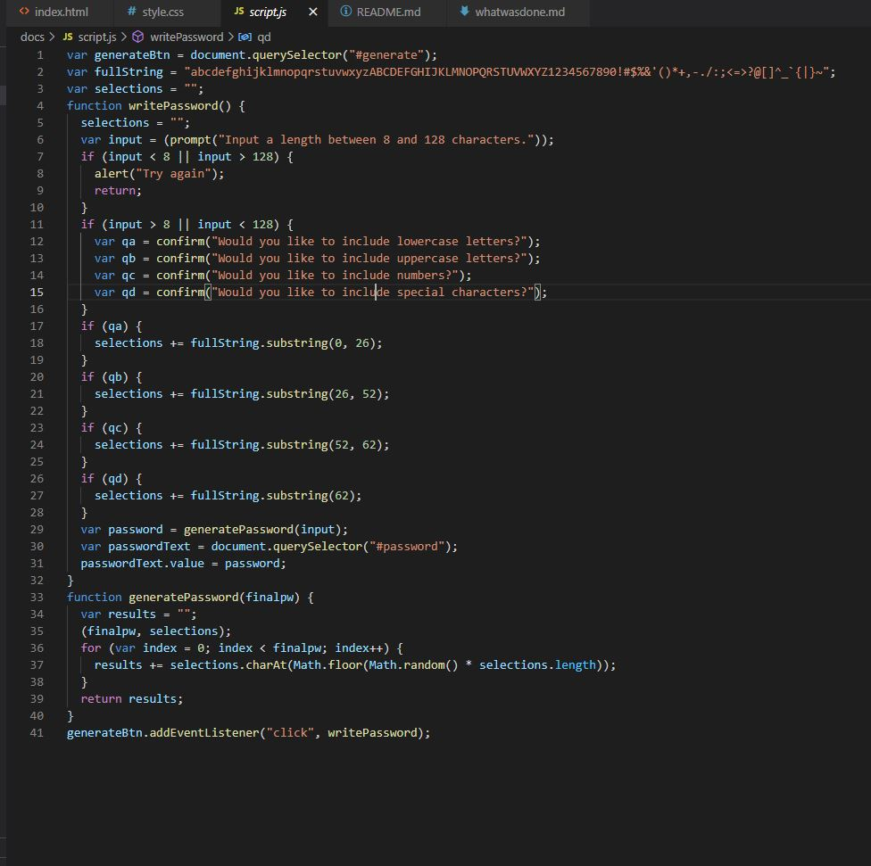
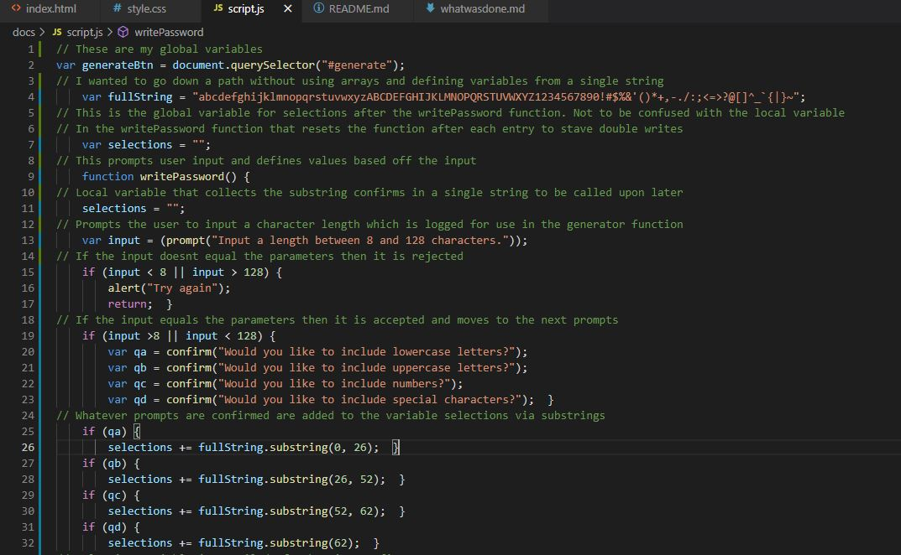
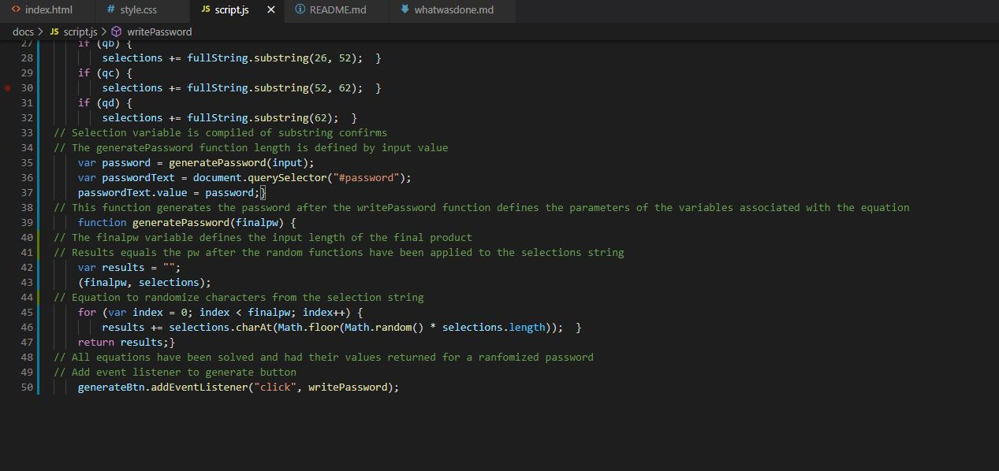

# ** Password Generator **

### * My Approach *

- I approached this assignment with a goal to make it as simplistic as possible
- After much research, I wanted to avoid the typical, cluttered array formulas 
- So I wrote the code global string variables where i could to reduce excess lines 
- This allowed me to make minimal computations therefore keeping the code very "clean"
- Without comment lines, there are only 41 lines of code on a standard format
- Thanks for looking

### * Acceptance Criteria *

- Generate a new, secure password
- Click the button to generate a password
- User is  presented with a series of prompts for password criteria
- Users selects which criteria to include in the password
- User is prompted for the length of the password
- User is prompted for character types to include in the password
- Input is validated and at least one character type should be selected
- When all prompts are answered, a password is generated that matches the selected criteria
- The password is then displayed in an alert or written to the page

### Here is the [Github Repo](https://github.com/JuStrait/PasswordGenerator) 

### Here is the [Deployed Page](https://justrait.github.io/PasswordGenerator/)

